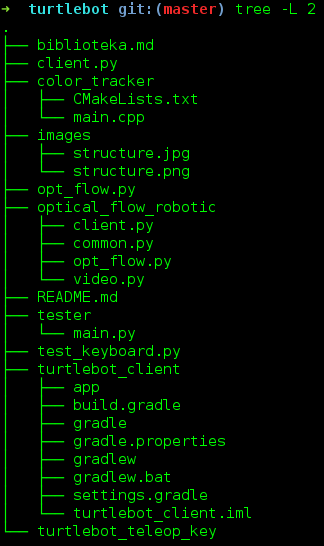

##STRUCTURE:##

This project contains few modules : 

* color_tracker - Track the movement of red ball with using laptop camera and red ball. So you can control the movement of turtlebot with using red ball.

* optical_flow_robotic -> In this module you can find a implementation of optical flow to control turtlebot.
* tester -> sample python server for testing our clients in java/c++/python

* test_keyboard.py -> sample python script to test keyboard

* turtlebot_client -> python script to control turtlebot from laptop with using keyboard

* turtlebot_teleop_key -> Our server on robot side to control movement

#Configuration#

##Server! ##

* Install ros hydro on turtlebot

* copy turtlebot_teleop_key ~/turtlebot/src/turtlebot_apps/turtlebot_teleop/scripts/

* Use ifconfig to get ip address of turtlebot

* Set correct ip in ~/turtlebot/src/turtlebot_apps/turtlebot_teleop/script/turtlebot_teleop_key

##CLIENTS##

###Turtlebot teleop key ###

* Must have : Unix + opencv + python2.7 + gcc

### color_tracker ###

* You need to setup a IP address for turtlebot.

* and cmake it :)!

###optical flow robotic ###

* Set server ip address in client.py

### Android ###

* Set correct ip in settings menu

Have fun!

